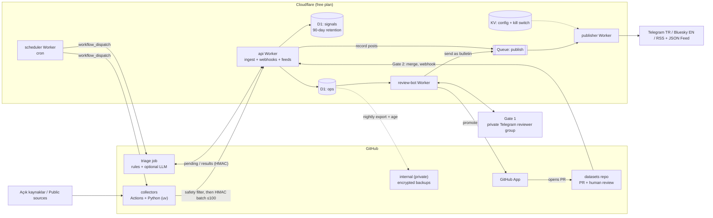

# Mimari / Architecture

[Türkçe](#türkçe) · [English](#english) · [Ücretsiz katman sınırları / Free-tier limits](#ücretsiz-katman-sınırları--free-tier-limits)

> Durum: tasarım (Aşama 1). Sayısal sınırlar sağlayıcıların ücretsiz planlarına aittir ve değişebilir; uygulamadan önce güncel belgelerle doğrulanmalıdır.
> Status: design (Phase 1). Numeric limits belong to the providers' free plans and may change; verify against current documentation before implementation.

## Genel görünüm / Overview

---

## Türkçe

### Tasarım ilkeleri

- **Sıfır bütçe:** Yalnızca ücretsiz katmanlar. Hiçbir hesapta ödeme yöntemi yok; sınırlar aşılırsa hizmet durur, fatura çıkmaz.
- **İnce Worker'lar, ağır iş Actions'ta:** Workers ücretsiz planında istek başına CPU süresi çok kısıtlıdır; ayrıştırma, normalleştirme ve model çağrıları Actions işlerinde yapılır.
- **İki insan kapısı:** Otomasyon hiçbir şeyi kendi başına yayımlamaz.
- **Güvenlik filtresi önce:** Türk kuvvetlerine ait olabilecek konum verisi depolamaya hiç ulaşmaz.

### 1. Toplayıcılar (collectors)

- Python ile yazılır, bağımlılıklar `uv` ile yönetilir; bu depoda **GitHub Actions işleri** olarak çalışır.
- Hedef tetikleme **scheduler Worker'ın `workflow_dispatch` çağrısıdır** (15 dakikalık sıklık için). Neden: herkese açık depolarda zamanlanmış iş akışları 60 gün depo etkinliği olmazsa otomatik devre dışı kalır ve yoğun saatlerde gecikmeli çalışır. Worker artık yazıldı ve testleriyle birlikte [`apps/scheduler`](apps/scheduler) içindedir; günde bir kez, `collect.yml`'nin bugünkü `schedule:` dakikasıyla aynı dakikada tetikler. **Henüz dağıtılmadığı için** bugünkü tetikleyici hâlâ [`.github/workflows/collect.yml`](.github/workflows/collect.yml) içindeki `schedule:` + `workflow_dispatch` ikilisidir; her çalışma tekilleştirme defterini `collector-state` dalına iterek 60 günlük sayacı diri tutar. Bu geçici sapma [ADR 0016](https://github.com/Greater-Turkiye/handbook/blob/main/decisions/0016-collector-schedule-until-worker.md) ile kayda geçmiştir; Worker dağıtılıp doğrulandığında tetikleyici Worker'a döner ve 0016'yı geçersiz kılan yeni bir ADR yazılır. 15 dakikalık sıklık ve toplayıcıların tek tek zamanlanması, `collector_state` için D1 bağlamalarıyla birlikte gelir.
- Sıklık en az **15 dakikadır**.
- Her çalıştırma: kaynağı çeker → normalleştirir → **güvenlik filtresini** uygular → en fazla **100 öğelik** partiler hâlinde **HMAC imzalı** olarak `api` Worker'ının ingest uç noktasına gönderir.
- Aday kaynaklar (kullanımdan önce her birinin lisans ve kullanım koşulları teyit edilecek):
  - resmî savunma bakanlığı / hükümet RSS akışları ve basın sayfaları,
  - GDELT,
  - NASA FIRMS (ücretsiz anahtar),
  - adsb.lol / OpenSky (ticari olmayan kullanım koşulları),
  - aisstream.io (ücretsiz API anahtarı),
  - Copernicus Data Space (Sentinel görüntüleri; keşif ve meta veri),
  - herkese açık Telegram kanalları, yalnızca `t.me/s/<kanal>` web önizlemeleri üzerinden (kullanıcı hesabı yok),
  - arşivleme için Wayback Machine Save Page Now (SPN2).
- **Güvenlik filtresi** (depolamadan önce, bellekte): Türkiye'ye ayrılmış ICAO 24-bit bloğundaki (`4B8000`–`4BFFFF`) ADS-B kayıtları, Türkiye MID'si (`271`) taşıyan MMSI'lı AIS kayıtları ve Türkiye coğrafi sınırı (geofence) içindeki her konum atılır. Ingest aynı filtreyi ikinci kez uygular. Ayrıntı: [collectors/README.md](collectors/README.md).

### 2. Operasyonel veritabanı: Cloudflare D1

- Ücretsiz plan: günde 5 milyon satır okuma, günde 100 bin satır yazma, veritabanı başına 500 MB, 7 günlük Time Travel (zamanda geri yükleme).
- İki veritabanı:
  - `ops` — inceleme kuyruğu, taslaklar, yayınlar, kota defteri, gözden geçiriciler, toplayıcı durumu;
  - `signals` — ham öğeler, **90 gün** saklama.
- Tekrar önleme: `content_hash` (normalleştirilmiş URL + metnin SHA-256'sı) üzerinde **UNIQUE** kısıt, yakın kopyalar için **simhash**.
- Supabase bilinçli olarak **kullanılmıyor**: ücretsiz projeler 7 gün hareketsizlikten sonra duraklatılıyor ve ücretsiz planda yedek yok.
- Tablo taslakları: [db/README.md](db/README.md).

### 3. Triyaj

- Önce çok dilli **anahtar sözcük kuralları** (bölge, aktör, teçhizat, olay türü sözlükleri).
- Sonra isteğe bağlı **dil modeli**: GitHub Models ücretsiz katmanı (modele göre günde yaklaşık 50–150 istek), yedek olarak Workers AI (günde 10 bin nöron).
- Model çıktısı yalnızca **şemaya göre doğrulanmış JSON**'dur; modele araç (tool) verilmez; model **asla yayımlayamaz**, yalnızca puan, etiket ve özet önerir.
- Her model çağrısı `usage_ledger` tablosuna yazılır. Günlük kota bittiğinde öğeler modelsiz olarak insan incelemesini bekler.

### 4. İki insan kapısı

- **Kapı 1 — bugün: `platform` deposunda bir konu.** Telegram botu (ve Worker) gelene kadar günlük `collect` işi, adayları `inceleme-kuyrugu` etiketli tarihli tek bir konuya onay kutusu listesi olarak yazar. Konuya yalnızca **ilgi süzgecini** geçen adaylar yazılır (izleme bölgesi + olay türü); eşiğin altındakiler silinmez, çalışma yapıtında kalır ve sayaç tablosunda görünür ([collectors/README.md](collectors/README.md#i̇lgi-süzgeci--relevance-filter)). Konudaki hiçbir satır yayımlanmış iddia değildir; gözden geçirici satırı işaretler ve kararını yorumda yazar. Sır gerekmez.
- **Kapı 1 — hedef: özel Telegram inceleyici grubu:** `review-bot` Worker'ı webhook ile çalışır; Telegram'ın gizli token başlığı doğrulanır, yalnızca izin listesindeki gözden geçiriciler işlem yapabilir. Her öğe için: **reddet**, **taslağa yükselt** veya **bülten olarak gönder**. İlk sürümü depoda ([apps/review-bot](apps/review-bot)): `onayla` / `reddet` / `sonra` ve kararın `gt-ops.reviews`'a yazılması hazır, **dağıtılmadı**; bülten yolu ve GitHub App çağrısı henüz yok. Onay yalnızca `status = 'drafted'` işaretidir, yayın değildir.
- **Kapı 2 — herkese açık:** Taslağa yükseltilen öğe için bir **GitHub App** `datasets` deposunda PR açar; gözden geçiriciler olağan kurallarla inceler ve birleştirir. Kişisel erişim token'ı (PAT) kullanılmaz; `GITHUB_TOKEN` ile açılan bot PR'ları CI'yi tetiklemediği için App gereklidir.

### 5. Yayıncılar

- `publisher` Worker'ı bir **Cloudflare Queue** kuyruğunu boşaltır (ücretsiz: günde 10 bin işlem ≈ 3.300 mesaj).
- Hız sınırları: kanal başına **saatte en fazla 4**, **günde en fazla 30** gönderi.
- **Acil durdurma (kill switch):** KV'de bir anahtar; Telegram grubunda `/stop` komutuyla açılır.
- Kayıt düzeltildiğinde veya kaldırıldığında **otomatik düzeltme gönderisi**.
- Kanallar: Telegram (TR, ana kanal), Bluesky (EN), RSS/JSON Feed. X ve Instagram **elle** (X API'nin Şubat 2026'dan beri ücretsiz katmanı yok; gönderi başına yaklaşık 0,015 USD). Mastodon daha sonra.
- Gönderi türleri: **bültenler** (A–B güvenilirlikteki kaynakların atfedilmiş açıklamaları, "doğrulanmamış" etiketiyle) ve **kayıtlar** (birleştirilmiş `datasets` kayıtlarından).
- Ayrıntı: [publishers/README.md](publishers/README.md).

### 6. Web (sonra)

- `datasets` sürümlerinden üretilen statik site; Cloudflare Workers statik varlıkları veya Pages üzerinde.
- Yönetim arayüzü Cloudflare Access arkasında (ücretsiz, 50 kullanıcıya kadar).

### 7. Yedekler

- D1 Time Travel (7 gün) ilk savunma hattıdır.
- Gecelik `wrangler d1 export` çıktısı, yöneticilerin **age** açık anahtarlarıyla şifrelenir ve özel `internal` deposuna **release varlığı** olarak yüklenir. Bu iş akışı `internal` deposunda çalışır; böylece Cloudflare anahtarı herkese açık bir depoda bulunmaz.
- Özel anahtarlar çevrimdışı tutulur; geri yükleme her çeyrekte bir denenir.

### 8. Güvenlik

- Ingest ve iç uç noktalarda HMAC-SHA256 imza + zaman damgası penceresi.
- Sırlar GitHub **environment**'larında. Dağıtım ve migration iş akışları **zorunlu gözden geçirici** onayı ister; sık çalışan toplayıcı ortamı ise yalnızca `main` dalıyla sınırlandırılır (her 15 dakikada onay beklenemez).
- Tüm üçüncü taraf Actions **tam commit SHA'sına sabitlenir**; güncellemeler Dependabot ile.
- En az yetki: iş akışlarında varsayılan `permissions: {}`; GitHub App kurulumları yalnızca gereken depolara ve izinlere sahiptir; kısa ömürlü kurulum token'ları kullanılır.
- Fork PR'larına sır verilmez; `pull_request_target` ile PR kodu çalıştırılmaz.
- Tehdit modeli: [docs/threat-model.md](docs/threat-model.md).

### Bilinen sınırlar ve riskler

- **Gerçek zamanlı değil:** 15 dakikalık sıklık artı Actions kuyruğu gecikmesi. Bu bir izleme ve kayıt sistemidir, alarm sistemi değildir.
- **GitHub Actions kullanım koşulları:** Actions'ın depo projesiyle ilgisiz amaçlarla (ör. genel amaçlı sunucusuz hesaplama) kullanımı kısıtlanmıştır. Toplayıcılar küçük, saygılı ve projenin veri yayınıyla doğrudan ilişkili tutulmalı; alternatif çalıştırıcı planı hazır olmalıdır.
- **Ücretsiz katman değişiklikleri:** Sağlayıcılar sınırları değiştirebilir. Her sınır tek bir yapılandırma dosyasında tutulur ve `usage_ledger` ile izlenir.
- **D1 yazma bütçesi:** Dizin güncellemeleri de yazılan satır sayısına dahildir; dizinler asgari tutulmalı, saklama süresi silmeleri partiler hâlinde yapılmalıdır. 500 MB sınırı 90 günlük saklamanın nedenidir.
- **Worker CPU sınırı:** Ağır işler Worker'larda yapılmaz.
- **Kaynak koşulları:** OpenSky ticari olmayan kullanım, adsb.lol veritabanı lisansı, Telegram kullanım koşulları, sitelerin kazıma kuralları. `t.me/s` önizlemeleri haber verilmeden değişebilir veya kapanabilir.
- **Dil modeli hataları:** Model uydurabilir; bu yüzden yalnızca öneri üretir, şemaya uymayan çıktı atılır.
- **Veri zehirleme / dezenformasyon:** Bültenler yalnızca A–B kaynaklardan, her zaman atfedilmiş ve "doğrulanmamış" etiketli.
- **Hesap ele geçirilmesi:** Acil durdurma, zorunlu 2FA, `internal` deposundaki eylem planları.
- **Kanal kapatılması:** Telegram veya Bluesky hesapları şikâyetle kısıtlanabilir; RSS ve `datasets` her zaman bağımsız kalır.
- **Kişiye bağımlılık (bus factor):** Her hesabın en az iki sahibi olmalıdır.

---

## English

### Design principles

- **Zero budget:** Free tiers only. No account has a payment method; when a limit is hit, the service stops instead of billing.
- **Thin Workers, heavy lifting in Actions:** Workers on the free plan have very limited CPU time per request; parsing, normalization and model calls happen in Actions jobs.
- **Two human gates:** Automation never publishes anything on its own.
- **Safety filter first:** Position data that could relate to Turkish forces never reaches storage.

### 1. Collectors

- Written in Python, dependencies managed with `uv`, run as **GitHub Actions jobs** in this repository.
- The target trigger is the **scheduler Worker calling `workflow_dispatch`** (for a 15-minute cadence). Why: scheduled workflows in public repositories are disabled automatically after 60 days without repository activity and run late at busy times. The Worker now exists, with its tests, in [`apps/scheduler`](apps/scheduler); it dispatches once a day, at the same minute `collect.yml`'s `schedule:` uses today. **It is not deployed yet**, so today's trigger is still the `schedule:` plus `workflow_dispatch` pair in [`.github/workflows/collect.yml`](.github/workflows/collect.yml), and each run pushes the dedup ledger to the `collector-state` branch, which keeps the 60-day counter alive. That temporary deviation is recorded in [ADR 0016](https://github.com/Greater-Turkiye/handbook/blob/main/decisions/0016-collector-schedule-until-worker.md); once the Worker is deployed and verified, the trigger returns to it and a new ADR supersedes 0016. The 15-minute cadence and per-collector scheduling arrive with the D1 bindings for `collector_state`.
- Cadence is at least **15 minutes**.
- Each run: fetch the source → normalize → apply the **safety filter** → post batches of at most **100 items**, **HMAC-signed**, to the ingest endpoint of the `api` Worker.
- Candidate sources (licence and terms of use to be confirmed for each before use):
  - official ministry of defence / government RSS feeds and press pages,
  - GDELT,
  - NASA FIRMS (free key),
  - adsb.lol / OpenSky (non-commercial terms),
  - aisstream.io (free API key),
  - Copernicus Data Space (Sentinel imagery; discovery and metadata),
  - public Telegram channels, only via the `t.me/s/<channel>` web previews (no user accounts),
  - Wayback Machine Save Page Now (SPN2) for archiving.
- **Safety filter** (in memory, before storage): drop ADS-B records in Türkiye's allocated ICAO 24-bit block (`4B8000`–`4BFFFF`), AIS records whose MMSI carries Türkiye's MID (`271`), and any position inside the Türkiye geofence. Ingest applies the same filter a second time. Details: [collectors/README.md](collectors/README.md).

### 2. Operational database: Cloudflare D1

- Free plan: 5 million rows read per day, 100,000 rows written per day, 500 MB per database, 7-day Time Travel (point-in-time restore).
- Two databases:
  - `ops` — review queue, drafts, publications, usage ledger, reviewers, collector state;
  - `signals` — raw items, **90-day** retention.
- Deduplication: a **UNIQUE** constraint on `content_hash` (SHA-256 of normalized URL + text), plus **simhash** for near-duplicates.
- Supabase is deliberately **not** used: free projects are paused after 7 days of inactivity and the free plan has no backups.
- Table sketches: [db/README.md](db/README.md).

### 3. Triage

- First, multilingual **keyword rules** (region, actor, equipment and event-type vocabularies).
- Then an optional **language model**: GitHub Models free tier (roughly 50–150 requests per day depending on the model), with Workers AI (10,000 neurons per day) as fallback.
- Model output is **schema-validated JSON only**; the model gets no tools; it **can never publish** and only proposes scores, labels and summaries.
- Every model call is written to the `usage_ledger` table. When the daily quota is exhausted, items wait for humans without model assistance.

### 4. Two human gates

- **Gate 1 — today: an issue in the `platform` repository.** Until the Telegram bot (and its Worker) exist, the daily `collect` job writes the candidates into one dated issue labelled `inceleme-kuyrugu` as a checklist. Only candidates that pass the **relevance filter** (a watch region and a recorded event type) become lines; the rest are kept in the run artifact and counted, never deleted ([collectors/README.md](collectors/README.md#i̇lgi-süzgeci--relevance-filter)). No line in it is a published claim; a reviewer ticks a line and records the decision in a comment. No secrets are needed.
- **Gate 1 — target: private Telegram reviewer group:** the `review-bot` Worker runs on a webhook; Telegram's secret token header is verified and only allowlisted reviewers can act. For each item: **dismiss**, **promote to draft**, or **send as bulletin**. Its first version is in the repository ([apps/review-bot](apps/review-bot)): `onayla` / `reddet` / `sonra` and the decision write to `gt-ops.reviews` are there, but it is **not deployed**, and the bulletin path and the GitHub App call do not exist yet. Approval only sets `status = 'drafted'`; it publishes nothing.
- **Gate 2 — public:** for an item promoted to draft, a **GitHub App** opens a PR in the `datasets` repository; reviewers review and merge under the usual rules. No personal access token (PAT) is used, and the App is required because bot PRs opened with `GITHUB_TOKEN` do not trigger CI.

### 5. Publishers

- The `publisher` Worker drains a **Cloudflare Queue** (free: 10,000 operations per day ≈ 3,300 messages).
- Rate limits: at most **4 posts per hour** and **30 per day** per channel.
- **Kill switch:** a key in KV, set with the `/stop` command in the Telegram group.
- **Automatic correction posts** when a record is corrected or removed.
- Channels: Telegram (TR, main), Bluesky (EN), RSS/JSON Feed. X and Instagram are **manual** (the X API has had no free tier since February 2026; about USD 0.015 per post). Mastodon later.
- Post types: **bulletins** (attributed statements from A–B rated sources, labelled "unverified") and **records** (from merged `datasets` records).
- Details: [publishers/README.md](publishers/README.md).

### 6. Web (later)

- Static site built from `datasets` releases, on Cloudflare Workers static assets or Pages.
- Admin UI behind Cloudflare Access (free for up to 50 users).

### 7. Backups

- D1 Time Travel (7 days) is the first line of defence.
- A nightly `wrangler d1 export` is encrypted with the maintainers' **age** public keys and uploaded as a **release asset** to the private `internal` repository. This workflow runs in `internal`, so the Cloudflare token never sits in a public repository.
- Private keys are kept offline; a restore is rehearsed every quarter.

### 8. Security

- HMAC-SHA256 signature plus a timestamp window on ingest and internal endpoints.
- Secrets live in GitHub **environments**. Deployment and migration workflows require **reviewer approval**; the frequently running collector environment is restricted to the `main` branch instead (approval every 15 minutes is not workable).
- All third-party Actions are **pinned to a full commit SHA**; updates come through Dependabot.
- Least privilege: default `permissions: {}` in workflows; GitHub App installations are limited to the repositories and permissions they need; short-lived installation tokens.
- No secrets for fork PRs; PR code is never run under `pull_request_target`.
- Threat model: [docs/threat-model.md](docs/threat-model.md).

### Known limits & risks

- **Not real-time:** 15-minute cadence plus Actions queue delay. This is a monitoring and record-keeping system, not an alerting system.
- **GitHub Actions terms:** use of Actions for purposes unrelated to the repository's project (e.g. general-purpose serverless computing) is restricted. Keep collectors small, polite and directly tied to the project's data publication, and keep an alternative runner plan ready.
- **Free-tier changes:** providers can change limits. Every limit is kept in one configuration file and tracked through `usage_ledger`.
- **D1 write budget:** index updates count as rows written; keep indexes minimal and run retention deletes in batches. The 500 MB limit is why retention is 90 days.
- **Worker CPU limit:** no heavy processing in Workers.
- **Source terms:** OpenSky non-commercial use, adsb.lol database licence, Telegram terms of service, site scraping rules. `t.me/s` previews can change or disappear without notice.
- **Language model errors:** models can fabricate; they only make suggestions, and output that fails the schema is discarded.
- **Data poisoning / disinformation:** bulletins come only from A–B sources, always attributed and labelled "unverified".
- **Account compromise:** kill switch, mandatory 2FA, playbooks in the `internal` repository.
- **Channel takedown:** Telegram or Bluesky accounts can be restricted after mass reports; RSS and `datasets` always remain independent.
- **Bus factor:** every account must have at least two owners.

---

## Ücretsiz katman sınırları / Free-tier limits

| Hizmet / Service | Ücretsiz sınır / Free limit | Kullanan bileşen / Used by |
|---|---|---|
| GitHub Actions (public repo) | Standart barındırılan çalıştırıcılar ücretsiz; iş başına en fazla 6 saat / Standard hosted runners free; max 6 h per job | collectors, triage |
| GitHub Actions (private repo, Free org) | Ayda 2.000 dakika / 2,000 minutes per month | `internal` backups |
| GitHub Models | Modele göre günde ~50–150 istek / ~50–150 requests per day depending on model | triage (LLM) |
| Cloudflare Workers | Günde 100.000 istek; çağrı başına 10 ms CPU; 5 cron tetikleyici / 100,000 requests per day; 10 ms CPU per invocation; 5 cron triggers | api, review-bot, scheduler (1 cron), publisher, web |
| Cloudflare D1 | Günde 5M satır okuma, 100k satır yazma; DB başına 500 MB; 7 gün Time Travel / 5M rows read, 100k rows written per day; 500 MB per DB; 7-day Time Travel | `ops`, `signals` |
| Cloudflare KV | Günde 100.000 okuma, 1.000 yazma / 100,000 reads, 1,000 writes per day | config, kill switch |
| Cloudflare Queues | Günde 10.000 işlem (≈3.300 mesaj) / 10,000 operations per day (≈3,300 messages) | publish queue |
| Workers AI | Günde 10.000 nöron / 10,000 neurons per day | triage fallback |
| Cloudflare Access | 50 kullanıcıya kadar / Up to 50 users | admin UI |
| NASA FIRMS | Ücretsiz MAP_KEY, anahtar başına istek sınırı / Free MAP_KEY, per-key request limit | FIRMS collector |
| aisstream.io | Ücretsiz API anahtarı / Free API key | AIS collector |
| Telegram Bot API | Ücretsiz / Free | review-bot, publisher |
| Bluesky (AT Protocol) | Ücretsiz; uygulama parolası / Free; app password | publisher |
| X API | Şubat 2026'dan beri ücretsiz katman yok (~0,015 USD/gönderi) / No free tier since Feb 2026 (~USD 0.015/post) | elle / manual |
